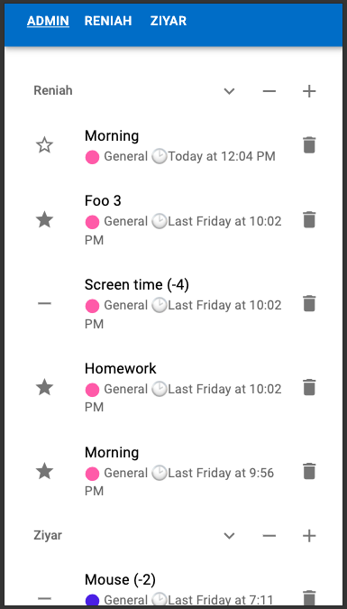
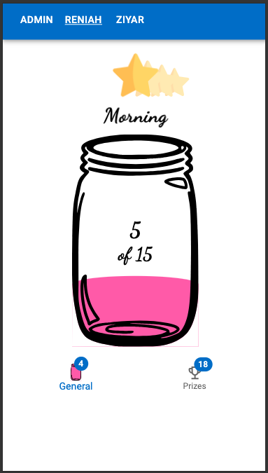
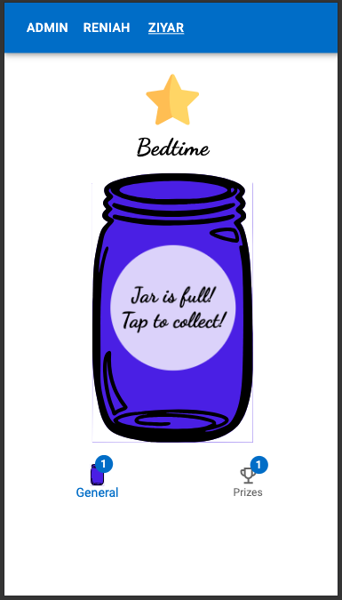

# Stars and Jars
This is an app I quickly made for my children to track rewards. They collect stars to fill up and collect filled jars for prizes.

Here are some screenshots:

The parent adds or removes stars


The child clicks the star to collect and fill the jar.


When the jar is full, the child clicks to add it to their prizes.


## Installation
In order to run this application, first create a Firebase project with Firestore then add some config files. Note: Account ID is just the ID of a document in Firestore /accounts/{accountId}.

Three configuration files are not included in the repository.
1. .env.local - holds the accountId to use in development
   ```properties
   VITE_ACCOUNT_ID=ABCDEF1234567890
   ```
2. .env.production.local - holds the accountId to use in production (npm run build)
   ```properties
   VITE_ACCOUNT_ID=ABCDEF1234567890
   ```
3. src/firebase/firebasecConfig.ts - exports the firebase config object.
   ```ts
   const firebaseConfig = {
      apiKey: "...",
      authDomain: "...",
      projectId: "...",
      storageBucket: "...,
      messagingSenderId: "...",
      appId: "..."
   };

   export default firebaseConfig;
   ```